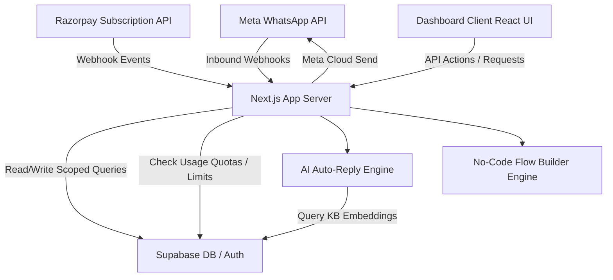

# Wachatra — System Architecture Guide

Welcome to the **Wachatra** developer onboarding guide. This document provides a comprehensive view of the platform's system architecture, core data flows, and design constraints to help new developers get up to speed quickly.

---

## 1. System Overview
Wachatra is a self-hostable, multi-tenant WhatsApp CRM and Business OS targeted at Indian SMBs and global agencies. The application is built on:
- **Core Framework**: Next.js (App Router, Server Actions, React 19)
- **Database & Security**: Supabase (PostgreSQL, Row-Level Security, multi-tenant organization isolation)
- **Communications**: Official Meta WhatsApp Cloud API (Graph API)
- **Payments / Subscription**: Razorpay (Webhooks, plans management)
- **AI Automation**: Auto-Reply Engine via OpenAI / Gemini / NIM querying custom Knowledge Base embeddings.

---

## 2. High-Level System Architecture

The following diagram illustrates how external interfaces (Meta Cloud API, Razorpay API, and users) interact with the Wachatra application layers:

---

## 3. Core Component Workflows

### 3.1 Inbound WhatsApp Webhook Flow
When a customer sends a message or a message's status transitions (e.g. read/delivered), Meta hits the webhook endpoint `/api/whatsapp/webhook`. 

```mermaid
sequenceDiagram
    autonumber
    participant Meta as Meta Cloud API
    participant Endpoint as /api/whatsapp/webhook
    participant DB as Supabase Database
    participant Flows as No-Code Flow Engine
    participant AI as AI Support Assistant

    Meta->>Endpoint: POST /api/whatsapp/webhook (signed with SHA256)
    Note over Endpoint: Verify x-hub-signature-256 against META_APP_SECRET
    Endpoint->>DB: Resolve org_id using phone_number_id (waba_connections)
    Endpoint->>DB: Fetch Owner/Admin user_id (caching for 5 mins)
    Endpoint-->>Meta: 200 OK (Acknowledge immediately to prevent retry storms)

    Note over Endpoint: Runs asynchronously using Next.js after()
    rect rgb(20, 20, 30)
        Endpoint->>DB: findOrCreateContact (De-duplication by phone number)
        Endpoint->>DB: findOrCreateConversation (Assigns contact thread)
        alt Inbound Message is a Reaction
            Endpoint->>DB: Upsert into message_reactions
        else Inbound Message is Interactive (Button/List Reply) or Text
            Endpoint->>DB: Insert message (status: delivered)
            Endpoint->>DB: Update conversation last_message_text & unread_count
            Endpoint->>Flows: dispatchInboundToFlows
            alt Flow Builder Consumed Message
                Note over Flows: Flow Engine handles reply logic
            else Flow Did NOT Consume Message
                Endpoint->>AI: dispatchInboundToAiReply
                Note over AI: Queries custom Knowledge Base embeddings
                AI->>Meta: Send AI-generated FAQ response
            end
        end
    end
```

---

## 4. Multi-Tenant Architecture & Database Security

Security and tenant isolation are enforced at the database level using **Supabase Row-Level Security (RLS)**.

### 4.1 Organization & Account Isolation
- Every core entity (contacts, conversations, messages, templates, webhooks) includes an `account_id` or `organization_id` column.
- Database tables have RLS policies ensuring that a user can only select/insert/update/delete rows if they belong to the organization associated with that row.
- Scopes and user roles (`owner`, `admin`, `agent`, `viewer`) are enforced at the database policy layer or in application service layers (e.g. `src/lib/auth/roles.ts`).

### 4.2 Razorpay Webhook Billing Limits
Subscriptions restrict usage metrics. The `checkQuota` utility (in `src/lib/billing/usage.ts`) enforces the following limits based on the organization's plan tier:
1. **WhatsApp Connected Sessions**: Number of active waba connections.
2. **Monthly Broadcast Quota**: Maximum messages sent in broadcast campaigns per month.
3. **Monthly Contacts Quota**: Maximum stored contact capacity.
4. **AI Reply Assistant usage**: Scoped LLM credits.

---

## 5. Directory Structure Directory Map
- `src/app/(landing)/`: Marketing landing page (Branded: Wachatra).
- `src/app/(dashboard)/`: Admin & Agent console panels.
- `src/app/api/whatsapp/webhook/`: Official Meta Webhook ingress point.
- `src/app/api/v1/`: Public developer REST APIs (paginated, scoped api-keys).
- `src/lib/api/error-handler.ts`: Unified error-handling middleware (`withErrorHandler`).
- `src/lib/automations/`: Automated keyword triggers and workflows execution.
- `src/lib/flows/`: Visual drag-and-drop chat flow logic.
- `supabase/migrations/`: SQL migration files defining schema structure & RLS rules.
