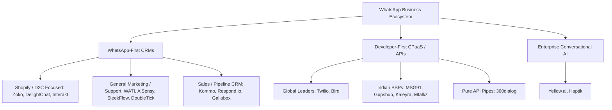

# Competitor Research & Market Analysis: WhatsApp CRM & CPaaS

This document contains a comprehensive analysis of the WhatsApp CRM, CPaaS (Communication Platform as a Service), and enterprise conversational AI market, with a focus on Indian SMBs, global agencies, and e-commerce brands. 

It provides strategic insights for the positioning, naming, and feature roadmap of **MJChatSyncs (InvoSuite)**.

---

## 1. Market Categorization Matrix

To understand the competitors, we classify them into three main segments based on their primary focus, technology depth, and user interface.

---

## 2. In-Depth Competitor Analysis

### Category A: WhatsApp-First CRM & Engagement Platforms

These platforms provide a ready-to-use user interface (UI) with shared inboxes, campaign managers, chatbot builders, and CRM integrations.

#### 1. WATI (WhatsApp Team Inbox & Automation)
*   **Target Audience:** Mid-market teams, customer support operations, and service-based SMBs.
*   **Core Offerings:** Robust shared inbox, collaborative team routing, CRM integrations (HubSpot, Zoho, Salesforce), and visual no-code flow builders.
*   **Strengths:** Extensive native CRM integrations; robust ticketing and agent collaboration tools (SLA tracking, internal notes).
*   **Considerations:** High subscription pricing (starts around ₹1,999 to ₹13,499+/month); charges a markup on Meta conversation fees on some plans; chatbot capabilities can become complex and expensive to scale.
*   **Pricing:** Tiered subscriptions based on features and contact limits, plus Meta conversation fees.

#### 2. Interakt
*   **Target Audience:** D2C (Direct-to-Consumer) and Shopify-based e-commerce brands in India.
*   **Core Offerings:** Out-of-the-box Shopify integration, automated abandoned cart recovery, order updates, post-purchase customer feedback, and interactive WhatsApp shopping catalogs.
*   **Strengths:** Best-in-class Shopify commerce workflows; very easy setup; transparent and competitive pricing structure (starts around ₹1,166/month).
*   **Considerations:** Less flexible for highly custom, non-commerce workflows; weak multi-channel support (focused almost entirely on WhatsApp).
*   **Pricing:** Fixed monthly subscription tiers based on features/scale, plus direct Meta conversation fees.

#### 3. AiSensy
*   **Target Audience:** Marketing teams, growth hackers, and businesses running high-volume outbound campaigns.
*   **Core Offerings:** Mass broadcasting, automated drip campaigns, Click-to-WhatsApp Ads (CTWA) management, and smart user segmentations.
*   **Strengths:** High campaign deliverability optimization; transparent pricing with no markups on Meta fees; fast onboarding.
*   **Considerations:** Shared inbox is basic compared to WATI; chatbot builder is less sophisticated than Gallabox or Yellow.ai.
*   **Pricing:** Subscription plan starts around ₹1,500/month, charging direct Meta conversation costs.

#### 4. Gallabox
*   **Target Audience:** Professional B2B/B2C services, real estate, education, and teams requiring advanced sales pipelines.
*   **Core Offerings:** AI-powered chatbot flows (integrating OpenAI/Claude), structured sales pipelines, and multi-channel shared inboxes.
*   **Strengths:** Advanced chatbot logic; visually appealing pipelines; strong AI agent integration.
*   **Considerations:** Premium pricing (₹3,599 to ₹14,999+/month); steeper learning curve for building complex flows.
*   **Pricing:** Tiered subscriptions based on the number of users and automation capacity.

#### 5. Respond.io
*   **Target Audience:** Mid-to-large global B2C enterprises requiring omnichannel capabilities.
*   **Core Offerings:** Omnichannel inbox (WhatsApp, Instagram, FB Messenger, Telegram, Viber, WeChat, SMS, Email), complex routing algorithms, and workflow automation.
*   **Strengths:** Exceptional scalability; highly flexible contact routing and ticket escalations; enterprise-grade security and API.
*   **Considerations:** Very expensive for small businesses; WhatsApp-specific features are part of a larger omnichannel system which might feel complex for WhatsApp-only users.
*   **Pricing:** Global pricing starts at $79/month, billed annually.

#### 6. SleekFlow
*   **Target Audience:** Retail, e-commerce, and high-touch sales teams looking for "conversational commerce."
*   **Core Offerings:** AI-first conversational assistant ("SleekFlow AI"), in-chat payment links (Stripe, etc.), customer tracking, and campaign automation.
*   **Strengths:** In-chat checkout and payment processing; multi-channel support; modern, polished UI.
*   **Considerations:** Higher price tiers for advanced AI agents and custom integrations.
*   **Pricing:** Tiered starting from a free/cheap tier up to $189+/month.

#### 7. Zoko
*   **Target Audience:** Small-to-medium Shopify sellers who want simple WhatsApp sales tools.
*   **Core Offerings:** WhatsApp shared inbox, catalog search, order taking within WhatsApp, and cart recovery.
*   **Strengths:** Extremely simple, focuses on turning WhatsApp into a checkout channel. Very popular with Indian SMBs using Shopify.
*   **Considerations:** Not suitable for non-Shopify brands; lack of advanced routing or ticketing structures.
*   **Pricing:** Pay-per-use markup model or monthly subscription starting at low pricing.

#### 8. DelightChat
*   **Target Audience:** Growing D2C brands looking for a clean, unified helpdesk.
*   **Core Offerings:** Shared inbox merging WhatsApp, Email, Instagram, and Live Chat; Shopify integration; marketing broadcasts.
*   **Strengths:** Extremely clean, Slack-like UI; highly responsive customer support; tailored specifically for customer service agents.
*   **Considerations:** Limited CRM functionality; best suited as a support desk rather than a sales tool.
*   **Pricing:** Subscription starting from ₹2,000/month.

#### 9. DoubleTick
*   **Target Audience:** Mobile-first sales teams, field agents, and SMBs.
*   **Core Offerings:** Mobile-first WhatsApp shared inbox, bulk marketing broadcasts, and catalog management.
*   **Strengths:** Excellent mobile application that feels exactly like personal WhatsApp, making it easy for field sales teams to adopt.
*   **Considerations:** Lacks advanced desktop-based customer support features or deep third-party CRM integrations.
*   **Pricing:** Starts around ₹2,000–₹3,000/month.

#### 10. Kommo (formerly amoCRM)
*   **Target Audience:** Sales teams requiring a structured visual sales pipeline.
*   **Core Offerings:** Pipeline-based CRM, automatic lead creation from messages, multi-channel messaging (WhatsApp, Instagram, FB, Email).
*   **Strengths:** Visual drag-and-drop sales pipeline; strong sales-oriented automation; AI copilot for agents.
*   **Considerations:** Charged on a per-user basis, which can get highly expensive for larger support teams.
*   **Pricing:** Starts around $15/user/month.

#### 11. TeleCRM
*   **Target Audience:** Indian SMBs, telecalling teams, and sales-heavy operations.
*   **Core Offerings:** Integrated calling + WhatsApp CRM, auto-dialer, lead tracking, call recording, and follow-up automation.
*   **Strengths:** Unifies phone calls and WhatsApp chats in one timeline; great for tracking outbound sales rep performance.
*   **Considerations:** Not specialized in e-commerce workflows or multi-channel social media support.
*   **Pricing:** Starts around ₹849–₹1,500/user/month.

#### 12. Vepaar (formerly WhatHash)
*   **Target Audience:** Small businesses, solopreneurs, and retail shops looking for lightweight organization.
*   **Core Offerings:** WhatsApp Web browser extension, customer tags, quick replies, simple web store creation, and basic ticketing.
*   **Strengths:** Super easy setup; works directly on top of the WhatsApp Web interface; built-in mini e-commerce store.
*   **Considerations:** Limited scalability; relies heavily on browser extensions and browser-based sessions rather than pure API.
*   **Pricing:** Free plan available; paid tiers start around ₹1,000–₹3,000/month.

#### 13. LimeChat
*   **Target Audience:** Growing D2C and e-commerce brands needing AI-driven support and sales.
*   **Core Offerings:** GPT-powered conversational AI agents, 2-way WhatsApp marketing, Shopify integrations, and catalog syncing.
*   **Strengths:** Excellent AI support automation (claims 70%+ automation rate); personalized commerce campaigns.
*   **Considerations:** Premium pricing; tailored specifically for e-commerce, not standard B2B sales pipelines.
*   **Pricing:** Custom quote-based pricing.

#### 14. WaliChat
*   **Target Audience:** Small-to-mid teams needing multi-number management and shared inboxes.
*   **Core Offerings:** Web-based multi-agent dashboard, support for multiple WhatsApp numbers, and developer APIs.
*   **Strengths:** Clean, simple shared inbox; supports connecting multiple WhatsApp numbers under one platform.
*   **Considerations:** Lacks advanced marketing campaign tools (e.g., cart recovery, bulk broadcasts).
*   **Pricing:** Subscriptions starting from $39/month.

#### 15. Picky Assist
*   **Target Audience:** SMBs looking for a balance of CRM features, bulk broadcasting, and low entry costs.
*   **Core Offerings:** Multi-agent shared inbox, visual chatbot builder, webhooks, and automation pipelines.
*   **Strengths:** Offer a "Free Forever" tier for basic usage; highly customizable webhooks for developers.
*   **Considerations:** Dashboard UI feels slightly dated compared to WATI or Interakt.
*   **Pricing:** Free basic tier; paid plans start at $10/month.

#### 16. ChatSyncs (Existing Platform)
*   **Target Audience:** Indian SMBs and marketing agencies needing CRM-to-WhatsApp synchronization.
*   **Core Offerings:** No-code chatbot builders, broadcast campaigns, and 27+ native integrations (Shopify, Razorpay, Google Sheets, IndiaMart, JustDial, Calendly).
*   **Status:** Already active and registered in the market. Must be avoided for new brand names to prevent trademark and branding conflicts.

---

### Category B: Developer-First API & CPaaS (Communication Platform as a Service) Providers

These companies are the direct pipes (Meta BSPs) that provide APIs, infrastructure, and deliverability. They are often integrated into front-end CRMs.

#### 1. Twilio
*   **Best For:** Global enterprise engineering teams building custom communications.
*   **Key Offerings:** High-performance REST APIs for WhatsApp, SMS, Voice, and Email.
*   **Pricing model:** Pay-as-you-go based on message volume (billed in USD) + Meta conversation fees.
*   **Strengths:** Unrivaled reliability (99.99% uptime), extensive documentation, global coverage.
*   **Weaknesses:** No ready-to-use CRM interface out-of-the-box (requires building a custom UI); expensive for local Indian messaging due to USD conversion.

#### 2. MSG91
*   **Best For:** Indian developer teams, startups, and cost-sensitive SMBs.
*   **Key Offerings:** Omnichannel API (SMS, WhatsApp, Voice, Email), OTP services, campaign manager ("Campaign"), support desk ("Hello").
*   **Pricing model:** INR-based pay-as-you-go with a prepaid wallet. No markup on Meta conversation fees.
*   **Strengths:** Excellent Indian market compliance (DLT assistance for SMS); extremely affordable; developer-friendly documentation.
*   **Weaknesses:** The ready-made UI dashboards are not as feature-rich or polished as WATI or Interakt.

#### 3. Gupshup
*   **Best For:** High-volume enterprises and automated conversational chatbots in India.
*   **Key Offerings:** Robust conversational API, no-code/low-code chatbot builders, and enterprise message routing.
*   **Pricing model:** Custom pricing based on high-volume contracts.
*   **Strengths:** Handles massive message throughput; strong localized sales and support in India.
*   **Weaknesses:** Complex developer dashboard; pricing and billing transparency can be difficult to manage without enterprise contracts.

#### 4. Bird (formerly MessageBird)
*   **Best For:** Engineering teams looking for developer-first global routing.
*   **Key Offerings:** Unified APIs for WhatsApp, SMS, Email, and Voice.
*   **Pricing model:** Usage-based (billed in USD) + Meta fees.
*   **Strengths:** Fast, reliable global routing; strong modern dashboard.
*   **Weaknesses:** Developer-heavy setup, lack of ready-made CRM tools.

#### 5. 360dialog
*   **Best For:** Independent Software Vendors (ISVs), CRMs, and white-label agencies.
*   **Key Offerings:** A pure, direct API connection to the WhatsApp Business API.
*   **Pricing model:** Standard monthly API fee per number + direct Meta conversation costs.
*   **Strengths:** Unfiltered API access with no added UI bloat; highly favored by agencies who build their own custom CRMs.
*   **Weaknesses:** Zero consumer-facing UI; developers must build the entire front-end dashboard.

#### 6. Kaleyra & Mtalkz
*   **Best For:** BFSI sector (Kaleyra) and SMBs needing personalized onboarding (Mtalkz).
*   **Key Offerings:** Multi-channel notification APIs, OTP delivery, custom compliance routing.
*   **Strengths:** Kaleyra excels in banking-grade compliance and security (SOC 2, ISO). Mtalkz provides 24/7 personalized onboarding support in India.
*   **Weaknesses:** Not designed as standard SaaS platforms; onboarding requires high touch.

#### 7. Gateway AI (Registered Platform)
*   **Best For:** B2B lead generation, growth, and custom CRM integrations.
*   **Key Offerings:** Automated outbound B2B lead generation, scraping, personalized outreach, and CRM synchronization.
*   **Strengths:** Strong focus on automated growth systems and B2B pipeline scale.
*   **Considerations:** Broad B2B growth engine, not exclusively a WhatsApp CRM platform.
*   **Status:** Registered brand name.

---

### Category C: Enterprise Conversational AI & Agentic Chatbots

#### 1. Yellow.ai & Haptik
*   **Best For:** Large enterprises (e.g., Banks, Airlines, Telecom, Large E-commerce) wanting autonomous customer service.
*   **Key Offerings:** Agentic AI platforms, multi-LLM orchestration, voice bots, and deep enterprise system integrations.
*   **Strengths:** AI-driven intent recognition; handles thousands of concurrent tickets without human intervention; multi-language capabilities.
*   **Weaknesses:** Enterprise pricing (typically requires annual contracts starting at several thousand USD); complex setup requiring conversational design experts.

---

### Category D: Specialized WhatsApp CRM & Marketing Agencies (India)

These agencies do not build SaaS software; instead, they provide strategic management, campaign execution, custom API setups, and chatbot flow building for businesses.

#### 1. DigitalDC
*   **Best For:** E-commerce and D2C brands looking for managed growth and personalized customer journeys.
*   **Key Services:** Custom API integrations, automated customer support setups, CRM configuration, and custom chatbot development.

#### 2. ROI Hunt
*   **Best For:** Brands needing end-to-end campaign execution and performance marketing via WhatsApp.
*   **Key Services:** Segmented broadcasting campaigns, template registration & approvals, Meta compliance management, and lead-nurturing strategy.

#### 3. Alpha Marketer
*   **Best For:** D2C stores looking to maximize ROI on WhatsApp notifications and broadcasts.
*   **Key Services:** Setting up Click-to-WhatsApp ads, cart abandonment drip sequences, and integration with Shopify/WooCommerce.

#### 4. 9 Digits Media
*   **Best For:** SMBs needing quick chatbot setups and multi-channel marketing campaigns.
*   **Key Services:** Conversational bot flow building, broadcasting management, transactional alerts (OTPs, order tracking), and CRM configurations.

#### 5. Webpulse
*   **Best For:** Businesses requiring local Indian regulatory support and brand verification.
*   **Key Services:** Meta Green Tick verification assistance, contact opt-in campaign strategies, interactive surveys, and bulk promotion handling.

---

## 3. Pricing Models & Meta Conversation Fees

When launching a WhatsApp CRM, understanding the cost structure is crucial to maintaining high margins. The cost consists of two parts:

$$\text{Total WhatsApp Cost} = \text{Meta Conversation Fee (Categorized)} + \text{Platform Markup / Subscription Fee}$$

### Meta Conversation Fee Categories (Charged per 24-Hour Session):
1.  **Marketing:** High cost. Sent to promote a product, announce offers, or run campaigns.
2.  **Utility:** Medium cost. Sent for order tracking, account notifications, or OTPs.
3.  **Authentication:** Low cost. Sent for single-use password (OTP) verification.
4.  **Service:** Lowest cost. Triggered when a user messages the business; any reply within 24 hours counts as a Service session.

### Competitor Pricing Strategies:
*   **Direct-Pass-Through (AiSensy, MSG91, 360dialog):** These charge a fixed subscription/API fee, and pass Meta's conversation fees *directly* to the client without adding markup. Highly preferred by large-volume clients.
*   **Markup Model (WATI on certain tiers, Gupshup):** These add a small per-message or per-conversation markup on top of Meta fees. This is a solid revenue stream but can drive away high-volume senders.

---

## 4. Common Naming Patterns & Trademark Analysis

### Naming Word Clouds in the Industry:
*   **Prefixes:** `WA-`, `Whats-`, `Chat-`, `Convo-`, `Client-`, `Team-`, `Lead-`, `Omni-`
*   **Suffixes:** `-Sync`, `-Inbox`, `-Flow`, `-Reply`, `-Connect`, `-Desk`, `-Bridge`, `-Pilot`, `-Hub`

### Trademark & Brand Collision Risks:
Meta (parent company of WhatsApp) is highly protective of its trademarks, and existing brands own many common combinations:
*   **Meta Trademark Prohibitions:** Using the exact word "WhatsApp" or "Whats" in your SaaS brand name (e.g., *WhatsDesk*, *WhatsFlow*) will result in instant trademark violation notices.
*   **The "WA" Grey Area:** Names starting with "WA" (e.g., *WATI*, *WACRM*) are common but legally vulnerable.
*   **Brand Collision Warnings:** 
    *   **ChatSyncs** is already a registered, active WhatsApp automation tool with native integrations (Razorpay, IndiaMart, Shopify). **Do not use this name.**
    *   **Gateway AI** is also a registered brand offering B2B AI growth engines.
*   **The Scalable Approach:** Successful modern SaaS platforms avoid Meta-linked prefixes and registered names entirely. Choosing a communication-agnostic, unique name establishes a legally defensible trademark and allows future integration of other channels (Instagram, Telegram, SMS, Email).

---

## 5. Strategic Roadmap & Branding for Wachatra (InvoSuite)

To succeed as an Indian-focused SaaS targeting SMBs and global agencies, **Wachatra** must pivot away from conflicting names like ChatSyncs and exploit the gaps left by the competitors.

### Gap Analysis & Opportunities:

| Competitor Weakness | Wachatra (InvoSuite) Opportunity |
| :--- | :--- |
| **High Per-Agent Fees:** Platforms like WATI and Kommo charge extra for seats, which penalizes scaling businesses. | **Flat-rate Pricing with Seats limit:** Offer generous agent seats on standard plans. |
| **Lack of White-Labeling:** Agencies cannot resell platforms like Interakt or AiSensy under their own brand. | **White-Label Reseller Portal:** Allow agencies to map custom domains (CNAME), upload custom logos, set custom colors, and manage their clients' billing. |
| **Complex Setup:** API providers require coding knowledge. | **No-Code Node-Based Bot Builder:** Visual canvas for managing routing, integrated with AI (Claude/Gemini). |
| **Siloed Channels:** E-commerce tools only support WhatsApp. | **Unified Workspace:** Built to eventually support WhatsApp, Instagram, Telegram, and Email inside the same inbox. |

### Recommended Brand Names (Non-Registered & Available):
Since the original repo was named `MJChatSyncs`, but the name "ChatSyncs" is taken in the market, we have chosen Wachatra. Here are the recommended available options:

1.  **InvoSuite** (Highly Recommended): Strong, enterprise-ready, premium white-label SaaS name that covers CRM, billing, and automation.
2.  **ConvoLoop**: Suggests conversations running smoothly on auto-pilot. High recall value.
3.  **Wachatra**: "Wa" (WhatsApp) + "Chatra/tantra" feel. Easy to pronounce/remember in the Indian market.
4.  **ClinchSuite**: "Clinch" means to settle or win a deal. Excellent for a sales CRM.
5.  **InboxWave**: Fresh, modern omnichannel inbox feel.
6.  **Deskly AI**: Suggests a modern helpdesk and automation assistant.

### Core Features to Deliver:
1.  **Multi-Tenant Architecture:** Strict database isolation with Supabase RLS.
2.  **Agency Reseller Panel:** Accent branding, domain mapping, custom SMTP.
3.  **Indian Payment Integrations:** Pre-integrated Razorpay webhook system for subscription management.
4.  **AI Assistant/Co-Pilot:** Native integration of Gemini/Claude to suggest automated drafts, translate messages, or execute automated support replies based on a workspace knowledge base.

---
*Research compiled on July 5, 2026. Data sourced from Meta Business Directory, CPaaS benchmark reviews, and official vendor specifications.*
